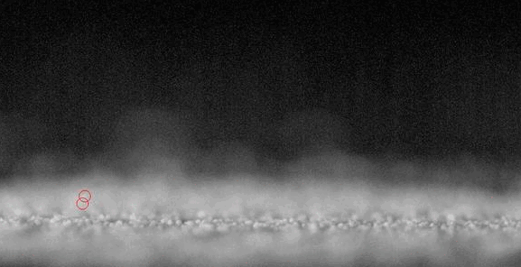
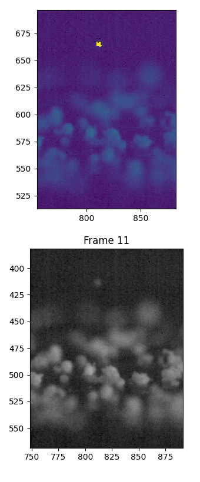
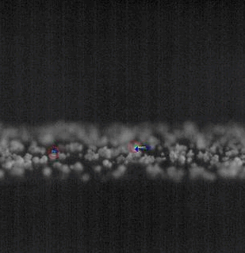
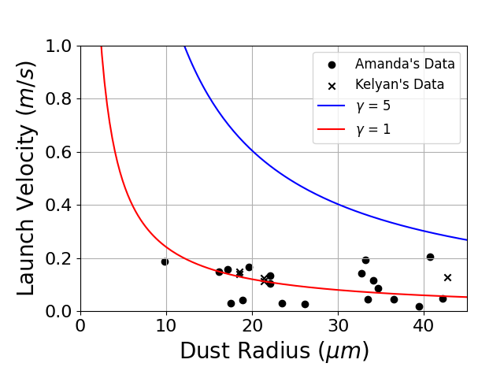

# Lofted Dust Particle Tracking

Amanda Elliott / contact: amel3682@colorado.edu

Use these scripts to track lofted particles that lofted due to an applied external electric field (high voltage) or lofted during charging (from an electron beam or UV light). The script can track multiple lofted particles, getting the velocity of each and their size. As long as three consecutive frames of movement are detected, it also calculates acceleration.



## List of Dependencies

The following Python libraries need to be installed.

- pillow
- numpy
- matplotlib
- argparse
- csv
- cv2
- uproot 
- matplotlib
- pandas 
- pprint
- scipy 

## Calculations

### High Voltage Lofting

For particles lofted during high voltage, particle charge is calculated from the equation of motion from the vertical equations of motion.

```text
ma = qE - mg
E = V/d
```

Where `V` is the external voltage applied when the particle lofted, and `d` is the distance over which the velocity is applied.

### Charging Lofting

For particles that lofted during charging, particle charge cannot be calculated. There is a correction to the vertical velocity from A. Carroll, *Laboratory measurements of initial launch velocities of electrostatically 
lofted dust on airless planetary bodies*, (2020).

The vertical velocity correction is as follows:

```python
v_y_updated = math.sqrt(v_y ** 2 + (2 * g * H))
```

Where `g` is the graviational acceleration, and `H` is the height that the particle has lofted to. The script will calculate this height of the lofted particle during it's trajectory.

## Instructions

### 1. Write an Input Video File

Edit the `video_info.txt` file and put it in the home directory for the video. For an example high voltage video, the file is described below.

```text
Frames per second (recorded): 900
Pixels to microns (1.64cm/(d1 [px]))*10^(4) --> [um]: 13.4
Beam voltage (V): 80
Beam current (mA): 8
Dust density (%): 80
High Voltage (kV): 1.51
Camera Angle (-1: calculate angle, otherwise use specified angle in degrees): 79 
d2 (px): 147
d1 (px): 1489
depth of field (px): 22
```

**For the charging script, the `high voltage` line is ommitted.**

Each property is described below:

- `frames per second` input is important for accurate velocity calculations. Note that this should be the fps that was recorded, which may not match the fps of the exported video. 
- `pixels to microns` is for proper scaling and size calculation. For this example, the dust sample is a circle of 1.64 cm, which in the video takes up 1489 pixels. Then the input is (1.64 cm / 1489) * 10^4 = 11.01 microns per pixel. 
- `beam voltage` and `beam current` are the values that the dust was charged to.
- `dust density` is the amount of dust coverage on the surface, as a percentage.
- `high voltage` is the amount of voltage applied to generate the external electric field when the lofting occured. 
- `camera angle` is `-1` if you want the script to calculate the angle from the given diameters of the circular dust sample, `d1` and `d2`. Otherwise, give the angle in degrees of the camera *with respect to vertical*. For the example, the camera is 11 degrees from horizontal, and so is 90 - 11 = 79 degrees. 
- `d2` is the short (vertical) diameter of the circular dust sample.
- `d1` is the long (horizontal) diameter of the circular dust sample, which is also used to calculate `pixels to microns`.
- `depth of field` is the height of the in-focus pixels. This is used to calculate the in-focus area of the dust sample.

### 2. Clip the video to individual lofting events.

The scripts works best if only 20-30 frames are run at one time. The main directory for the video should contain the `video_info.txt` file. Cut the video to smaller clips and save them to separate folders in this main directory. There is a `video_goes_here` file where a video clip would go. (The video was too large to be uploaded to GitHub.)

**The following Steps (3-5) would need to be repeated for each of the individual video clips.**

### 3. Convert video to individual frames (jpegs)

Run the following command. 

```python
python video_to_frames.py <directory> <video file name> --contrast <value>
```

Now the video image frames will be in the same directory as the video file. These frames are the input for the particle tracking script.

#### Increase Contrast

The `--contrast` argument is optional. It may be necessary to increase the contrast of the frames before running the particle tracking script on them, which makes it easier for the script to track movement and accurately calculate size of lofted particles. The amount of contrast increase is specified by `<value>`. A value of 1.0 gives back the original image, which is the default value. Increasing this value will increase the contrast.  

### 4. Run the Script

For a high voltage video, run:

```python
python high_voltage.py <directory> --start <first frame> --end <last frame> --movement <movement threshold> --dust <dust size threshold> --sizes <size start>-<size end>
```

For a charging video, run:

```python
python charging.py <directory> --start <first frame> --end <last frame> --movement <movement threshold> --dust <dust size threshold> --sizes <size start>-<size end>
```

The particle tracking script will only run on the frames specified by `--start` and `--end`.  After running this command, tracking results will appear in the `lofted` folder. The images in this folder will have a red circle over the detected particle center, and green arrows representing velocity vectors. Flipping through these images verifies the tracking results.

The optional input parameters are described below.

`<movement threshold>` is the brightness range for tracking movement. The default value is 30. If the script is detecting noise as particles, decrease this number. If the script is not detecting moving particles, increase this number, or increase the contrast of the frames. 

`<dust size threshold>` is used for calculating the size of lofted particles. The default value is 5. If the size of the lofted particle is too small, increase this value. If the calculated size is too large, decrease it. The size calculation can be checked by generating brightness plots after the size calculation is performed. 

`--sizes` is an optional command line argument to verify the size calculation of the lofted particles. `<size start>` and `<size end>` specify the range of frames that you want to view the brightness maps for. **The brightness map and the corresponding original frame will appear at the end.** You can zoom in on the bright yellow region that is the region that the script calculated the particle size to be and compare it with the unedited frame. The script currently does not automatically save brightness maps, but just shows them. Here is an example plot:



For the provided charging example, here is the command that was run in it's entirety: 

```
python charging.py examples/charging/clip0 --start 40 --end 52 --movement 35 --dust 10 --sizes 42-43
```

Run the script, altering the command line arguments, until the tracking results and size calculations are accurate. 

The input parameters and results are saved in the `data.csv` file. This file is overwritten each time the script is run.

### 5. Additional Steps for Charging 

#### 5.1. Lofted Angle Calculation



For particles that loft during charging, the trajectories are parabolic. To calculate the lofted angle, save the locations from the `data.csv` file for that particle into a `locations.csv` file. If the particle is missing for a frame, place a `M` in that row. An example file is:

```text
Locations
(1662.6,472.6)
(1669.0,465.0)
M
M
(1692.0,442.0)
(1701.6666666666667,435.6666666666667)
(1710.0,431.0)
(1717.6666666666667,427.6666666666667)
(1726.0,425.0)
(1734.3333333333333,424.3333333333333)
(1744.0,423.0)
(1753.0,423.0)
```

Automatically generating locations files for each lofted particle could be developed in the future, but handling particles that temporarily go missing for a frame or two would be tricky.

Then run the script:

```python
python lofting_angle.py <directory> --start <first frame> --end <last frame> 
```

The directory is what contains the jpegs to be processed. In this folder, an `angle` folder will be created. The calculated parabolic trjectory and angle calculation are drawn on the frames for verification and placed in this folder.

#### 5.2. Post Processing

For each lofted particle event, save the data (particle size, velocity, acceleration, lofted angle, etc.) as a row on a `master.csv` file. An example file is provided.

Then run the `post_processing.py` file to generate plots, like below.


